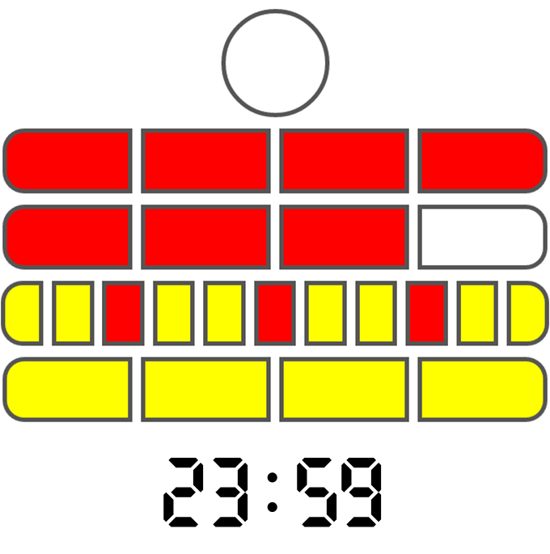

# Berlin Clock


## About this Kata
This short and simple Kata should be performed using Test Driven Development (TDD).
## Rules
The Berlin Clock (Mengenlehreclock or Berlin Uhr) is a clock that tells the time using a series of illuminated coloured blocks, as you can see in the picture for this project.

- The **top lamp** blinks to show **seconds**; it is illuminated on **even seconds** and off on **odd seconds**.

- The next two rows represent **hours**:
    - The **upper row** represents **5-hour blocks** and is made up of **4 red lamps**.
    - The **lower row** represents **1-hour blocks** and is also made up of **4 red lamps**.

- The final two rows represent **minutes**:
    - The **upper row** represents **5-minute blocks** and is made up of **11 lamps**—every third lamp is **red**, while the rest are **yellow**.
    - The **bottom row** represents **1-minute blocks** and is made up of **4 yellow lamps**.

## Requirements

- **Java** : 1.8
- **Springboot** : 2.7
- **Maven** : For Dependency management
- **JUnit** : 5.x

## Commit Message Style Guide
The project have followed the [Udacity Git Commit Message Style Guide](https://udacity.github.io/git-styleguide/), which provides a consistent format for writing commit messages.
Each commit messages contains **Title**. The title consists of the type of the message and subject. `type: Subject`

#### Commit Types

- **feat**: A new feature
- **fix**: A bug fix
- **docs**: Changes to documentation
- **style**: Code formatting changes (e.g., fixing indentation, removing spaces, etc.)
- **refactor**: Code refactoring without affecting functionality
- **test**: Adding or refactoring tests
- **chore**: Updates to build processes or auxiliary tools (e.g., package manager configs)

## How to Build the Application

- Clone this repository:
   ```bash
   https://github.com/2024-DEV3-007/BerlinClock
- Build the project and run the tests by running
    ```bash
    mvn clean install
- The **Model Classes** used in the project are generated from the **OpenAPI** specification during the build process. Running `mvn clean install` will regenerate the models as part of the build.

## Sample Input and Output

The following is a sample input to the Berlin Clock API and the corresponding output:

### Sample Input
This JSON input represents the time `23:59:59` in hours, minutes and seconds.

- File: `src/main/resources/examples/sample-input.json`
- Example:
  ```json
  {
    "time": {
      "hours": "23",
      "minutes": "59",
      "seconds": "59"
    }
  }

### Sample Output
This is the JSON response for the Berlin Clock representation of the time `23:59:59`.

- File: `src/main/resources/examples/sample-output.json`
- Example:
  ```json
  {
    "digitalTime": "23:59:59",
    "detailedBerlinTime": {
        "secondsLamp": "O",
        "topFiveHourLamps": "RRRR",
        "bottomOneHourLamps": "RRRO",
        "topFiveMinuteLamps": "YYRYYRYYRYY",
        "bottomOneMinuteLamps": "YYYY"
    },
    "berlinTime": "O RRRR RRRO YYRYYRYYRYY YYYY"
  }
  
## Test reports

- Once after successful build of
  `mvn clean install`, navigate to target folder of the project root directory
- **Jacoco code coverage report :** Code Coverage report will be available in `target\site\jacoco` folder. View the report by launching **index.html**
- **pi test coverage report:** Mutation Coverage report will be available in `target\pit-reports` folder. View the report by launchig **index.html**